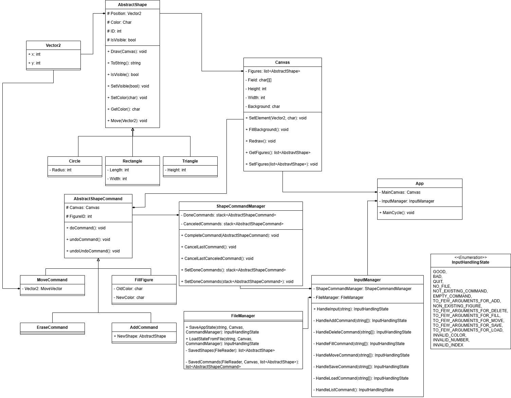

# Console Paint app
This github repository contains console paint App created for Lab Work by Mahiliavets Dzianis form group 353505. 
## UI description
Basic UI includes canvas in frame and command line, where user can input commands, that will take some effect. Example you can seee bellow
\|__________________________________________  |
| h h h h h h h h h h h h h h h h h h h h h h h h h h h h h h h h h |
| h h h h h h h h h h h h h h h h h h h h h h h h h h h h h h h h h |
| h h h h h h h h h h h h h h h h h h h h h h h h h h h h h h h h h |
| h h h h h h h h h h h h h h h h h h h h h h h h h h h h h h h h h |
| h h h h h h h h h h h h h h h h h h h h h h h h h h h h h h h h h |
| h h h h h h h h h h h h h h h h h h h h h h h h h h h h h h h h h |
| h h h h h h h h h h h h h h h h h h h h h h h h h h h h h h h h h |
| h h h h h h h h h h h h h h h h h h h h h h h h h h h h h h h h h |
| h h h h h h h h h h h h h h h h h h h h h h h h h h h h h h h h h |
| h h h h h h h h h h h h h h h h h h h h h h h h h h h h h h h h h |
| h h h h h h h h h h h h h h h h h h h h h h h h h h h h h h h h h |
| h h h h h h h h h h h h h h h h h h h h h h h h  h h h h h h h h h |
| h h h h h h h h h h h h h h h h h h h h h h h h  h h h h h h h h h |
\|___________________________________________|
Input your command: ...

## Functions
All available functions are listed in this paragraph 
# add [figure_name] [init_position] [color] [figure-params]
Supported figures - equilateral triangle, circle, resctangle.
All sizes are in amount of characters. Color is character (except space and all control characters), that will be used to fill figure. 
Parameter for circle is radius, for triangle - height, for rectangle - width and height.
Init position is two numbers, that determine initial position. The start of coordinats (0,0) is in upper left corner, first number is x coordinat, that grows from left to right, second y coordinat that grows from up to down.
Initial position for triangle is its upper vertex (triangle is facing up), for circle is its center, for rectangle position of its upper left corner.
Examples of using add command:
**add circle 7 6 - 5** 
```
\|__________________________________________  |
| h h h h h h h h h h h h h h h h h h h h h h h h h h h h h h h h h |
| h h h h h h h h h h h h h h h h h h h h h h h h h h h h h h h h h |
| h h h h h h - h h h h h h h h h h h h h h h h h h h h h h h h h h |
| h h h h - - - - - h h h h h h h h h h h h h h h  h h h h h h h h h |
| h h h - - - - - - - h h h h h h h h h h h h h h  h h h h h h h h h |
| h h h - - - - - - - h h h h h h h h h h h h h h  h h h h h h h h h |
| h h - - - - - - - - - h h h h h h h h h h h h h  h h h h h h h h h |
| h h h - - - - - - - h h h h h h h h h h h h h h  h h h h h h h h h |
| h h h - - - - - - - h h h h h h h h h h h h h h  h h h h h h h h h |
| h h h h - - - - - h h h h h h h h h h h h h h h  h h h h h h h h h |
| h h h h h h - h h h h h h h h h h h h h h h h h  h h h h h h h h h |
| h h h h h h h h h h h h h h h h h h h h h h h h  h h h h h h h h h |
| h h h h h h h h h h h h h h h h h h h h h h h h  h h h h h h h h h |
\|___________________________________________|
```
**add rectangle 3 3 ) 7 2**
```
\|__________________________________________  |
| h h h h h h h h h h h h h h h h h h h h h h h h h h h h h h h h h |
| h h h h h h h h h h h h h h h h h h h h h h h h h h h h h h h h h |
| h h h h h h h h h h h h h h h h h h h h h h h h h h h h h h h h h |
| h h h ) ) ) ) ) ) ) h h h h h h h h h h h h h h h h h h h h h h h |
| h h h ) ) ) ) ) ) ) h h h h h h h h h h h h h h h h h h h h h h h |
| h h h h h h h h h h h h h h h h h h h h h h h h h h h h h h h h h |
| h h h h h h h h h h h h h h h h h h h h h h h h h h h h h h h h h |
| h h h h h h h h h h h h h h h h h h h h h h h h h h h h h h h h h |
| h h h h h h h h h h h h h h h h h h h h h h h h h h h h h h h h h |
| h h h h h h h h h h h h h h h h h h h h h h h h h h h h h h h h h |
| h h h h h h h h h h h h h h h h h h h h h h h h h h h h h h h h h |
| h h h h h h h h h h h h h h h h h h h h h h h h  h h h h h h h h h |
| h h h h h h h h h h h h h h h h h h h h h h h h  h h h h h h h h h |
\|___________________________________________|
```
**add triangle 8 3 . 7**
```
\|__________________________________________  |
| h h h h h h h h h h h h h h h h h h h h h h h h h h h h h h h h h |
| h h h h h h h h h h h h h h h h h h h h h h h h h h h h h h h h h |
| h h h h h h h h h h h h h h h h h h h h h h h h h h h h h h h h h |
| h h h h h h h h . h h h h h h h h h h h h h h h h h h h h h h h h |
| h h h h h h h . . . h h h h h h h h h h h h h h h h h h h h h h h |
| h h h h h h . . . . . h h h h h h h h h h h h h h h h h h h h h h |
| h h h h h . . . . . . . h h h h h h h h h h h h h h h h h h h h h |
| h h h h . . . . . . . . . h h h h h h h h h h h h h h h h h h h h |
| h h h . . . . . . . . . . . h h h h h h h h h h h h h h h h h h h |
| h h . . . . . . . . . . . . . h h h h h h h h h h h h h h h h h h |
| h h h h h h h h h h h h h h h h h h h h h h h h h h h h h h h h h |
| h h h h h h h h h h h h h h h h h h h h h h h h  h h h h h h h h h |
| h h h h h h h h h h h h h h h h h h h h h h h h  h h h h h h h h h |
\|___________________________________________|
```
# ls
Lists all figures currently presented on canvas and its ids.
Example use:
**ls**
1 triangle_9
2 triangle_3
5 circle_7
7 rectangle_5_2

# delete [figure_id]
Deletes figure with provided id
Example use:
**ls**
1 triangle_9
2 triangle_3
5 circle_7
7 rectangle_5_2
**delete 7**
**ls**
1 triangle_9
2 triangle_3
5 circle_7
# fill [figure_id] [color]
Fills figure with provided id with provided color.
Example use:
```
\|__________________________________________  |
| h h h h h h h h h h h h h h h h h h h h h h h h h h h h h h h h h |
| h h h h h h h h h h h h h h h h h h h h h h h h h h h h h h h h h |
| h h h h h h h h h h h h h h h h h h h h h h h h h h h h h h h h h |
| h h h h h h h h . h h h h h h h h h h h h h h h h h h h h h h h h |
| h h h h h h h . . . h h h h h h h h h h h h h h h h h h h h h h h |
| h h h h h h . . . . . h h h h h h h h h h h h h h h h h h h h h h |
| h h h h h . . . . . . . h h h h h h h h h h h h h h h h h h h h h |
| h h h h . . . . . . . . . h h h h h h h h h h h h h h h h h h h h |
| h h h . . . . . . . . . . . h h h h h h h h h h h h h h h h h h h |
| h h . . . . . . . . . . . . . h h h h h h h h h h h h h h h h h h |
| h h h h h h h h h h h h h h h h h h h h h h h h h h h h h h h h h |
| h h h h h h h h h h h h h h h h h h h h h h h h  h h h h h h h h h |
| h h h h h h h h h h h h h h h h h h h h h h h h  h h h h h h h h h |
\|___________________________________________|
```
**ls**
1 triangle_7
**fill 1 O**
```
\|__________________________________________  |
| h h h h h h h h h h h h h h h h h h h h h h h h h h h h h h h h h |
| h h h h h h h h h h h h h h h h h h h h h h h h h h h h h h h h h |
| h h h h h h h h h h h h h h h h h h h h h h h h h h h h h h h h h |
| h h h h h h h h O h h h h h h h h h h h h h h h h h h h h h h h h |
| h h h h h h h O O O h h h h h h h h h h h h h h h h h h h h h h h |
| h h h h h h O O O O O h h h h h h h h h h h h h h h h h h h h h h |
| h h h h h O O O O O O O h h h h h h h h h h h h h h h h h h h h h |
| h h h h O O O O O O O O O h h h h h h h h h h h h h h h h h h h h |
| h h h O O O O O O O O O O O h h h h h h h h h h h h h h h h h h h |
| h h O O O O O O O O O O O O O h h h h h h h h h h h h h h h h h h |
| h h h h h h h h h h h h h h h h h h h h h h h h h h h h h h h h h |
| h h h h h h h h h h h h h h h h h h h h h h h h  h h h h h h h h h |
| h h h h h h h h h h h h h h h h h h h h h h h h  h h h h h h h h h |
\|___________________________________________|
```

# move [figure_id] [delta_x] [delta_y]
Moves figure with provided id on the given delta (delta_x and delta_y can be negative)
Example:
```
\|__________________________________________  |
| h h h h h h h h h h h h h h h h h h h h h h h h h h h h h h h h h |
| h h h h h h h h h h h h h h h h h h h h h h h h h h h h h h h h h |
| h h h h h h h h h h h h h h h h h h h h h h h h h h h h h h h h h |
| h h h h h h h h . h h h h h h h h h h h h h h h h h h h h h h h h |
| h h h h h h h . . . h h h h h h h h h h h h h h h h h h h h h h h |
| h h h h h h . . . . . h h h h h h h h h h h h h h h h h h h h h h |
| h h h h h . . . . . . . h h h h h h h h h h h h h h h h h h h h h |
| h h h h . . . . . . . . . h h h h h h h h h h h h h h h h h h h h |
| h h h . . . . . . . . . . . h h h h h h h h h h h h h h h h h h h |
| h h . . . . . . . . . . . . . h h h h h h h h h h h h h h h h h h |
| h h h h h h h h h h h h h h h h h h h h h h h h h h h h h h h h h |
| h h h h h h h h h h h h h h h h h h h h h h h h  h h h h h h h h h |
| h h h h h h h h h h h h h h h h h h h h h h h h  h h h h h h h h h |
\|___________________________________________|
```
**move 1 5 0**
```
\|__________________________________________  |
| h h h h h h h h h h h h h h h h h h h h h h h h h h h h h h h h h |
| h h h h h h h h h h h h h h h h h h h h h h h h h h h h h h h h h |
| h h h h h h h h h h h h h h h h h h h h h h h h h h h h h h h h h |
| h h h h h h h h h h h h h . h h h h h h h h h h h h h h h h h h h |
| h h h h h h h h h h h h . . . h h h h h h h h h h h h h h h h h h |
| h h h h h h h h h h h . . . . . h h h h h h h h h h h h h h h h h |
| h h h h h h h h h h . . . . . . . h h h h h h h h h h h h h h h h |
| h h h h h h h h h . . . . . . . . . h h h h h h h h h h h h h h h |
| h h h h h h h h . . . . . . . . . . . h h h h h h h h h h h h h h |
| h h h h h h h . . . . . . . . . . . . . h h h h h h h h h h h h h |
| h h h h h h h h h h h h h h h h h h h h h h h h h h h h h h h h h |
| h h h h h h h h h h h h h h h h h h h h h h h h  h h h h h h h h h |
| h h h h h h h h h h h h h h h h h h h h h h h h  h h h h h h h h h |
\|___________________________________________|
```
# undo
Canceles the result of the last action (moving, filling, deleting or creating figure). Can be done after another undo or sequences of them, than it will cancel corresponding action. If no actions were taken, then this command will do nothing. Can be performed after loading canvas from file.
# redo
Cancels the last undo command, if no actions were done in between, otherwise does nothing. Can be performed after loading canvas from file.
# save [file_path]
Saves current state of canvas and actions to files, if provided path is valid. Otherwise creates file by given path and saves state there.
# load [file_path]
Loads canvas from file.

## UML Diagramm
On the picture bellow you can see UML Diagramm of all classes used in programm.

